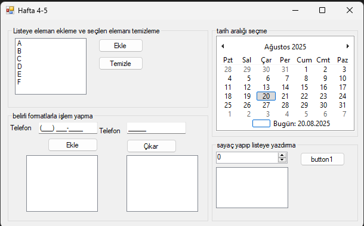

# Görsel Programlama Ders Projeleri (C#)

Bu depo, Görsel Programlama dersinde her hafta yaptığım C# uygulamalarını içermektedir.  
Her proje kendi klasöründe yer almakta ve ilgili haftaya ait ekran görüntüleri de eklenmiştir.

## Kullanılan Teknolojiler

- **C#**: Temel ve ileri seviye programlama  
- **Windows Forms (WinForms)**: Masaüstü uygulama geliştirme  
- **Visual Studio**: Geliştirme ortamı  

## Proje Yapısı

Her haftanın uygulamaları kendi klasöründe bulunur
- `Program.cs` ve `Form1.cs` gibi dosyalar uygulamanın kaynak kodlarını içerir.  
- `Screenshot.png` dosyası, uygulamanın çalışırken alınmış ekran görüntüsüdür.

## 📸 Ekran Görüntüleri





## Kurulum ve Çalıştırma

1. Depoyu klonlayın:

```bash
git clone https://github.com/rdvan45keskin/Visual-Programming-Lab.git


